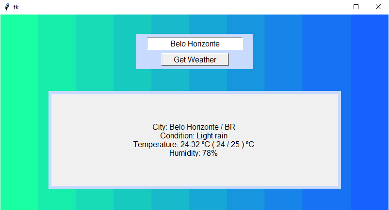

# Practice of GUI creation and API usage in Python
Made using Tkinter and OpenWeather API ( https://openweathermap.org/api )

The key used in code is an example. A new one can be created at https://openweathermap.org/api.

A sample of the application 
