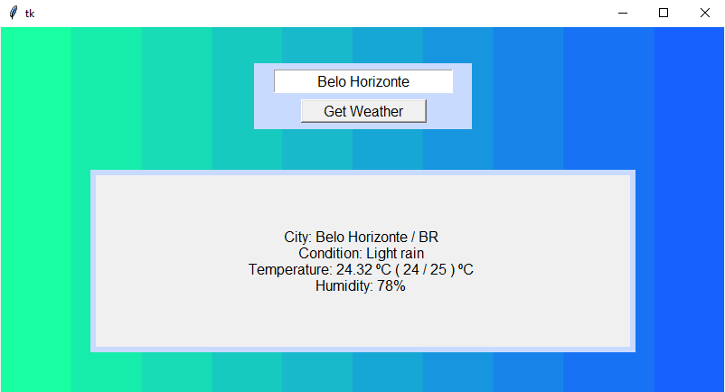
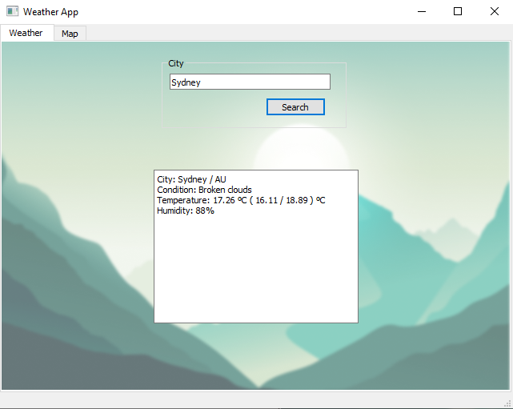

# Practice of GUI creation and API usage in Python
 Two versions of the app were created using two different toolkits: Tkinter and PyQt5.

The key used in code is an example. A new one can be created at [OpenWeather API]( https://openweathermap.org/api ) and should be stored in an api-key.txt file in the script folder.

## Screenshots
### Tkinter

### PyQt5

